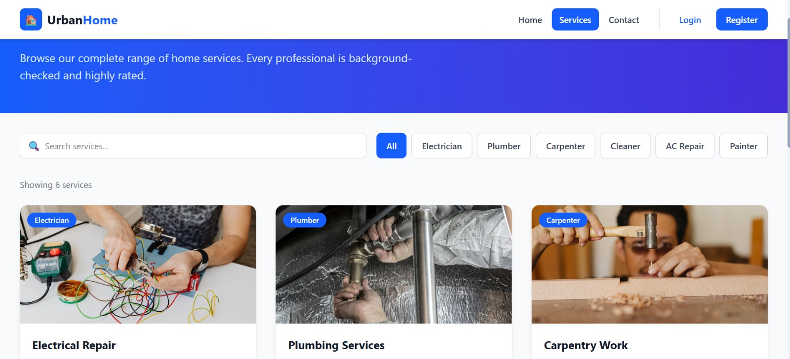
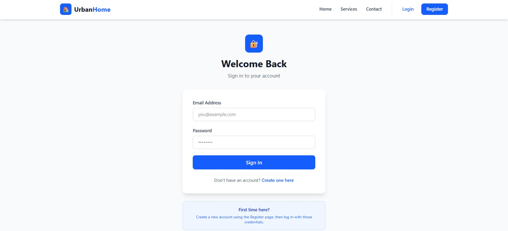
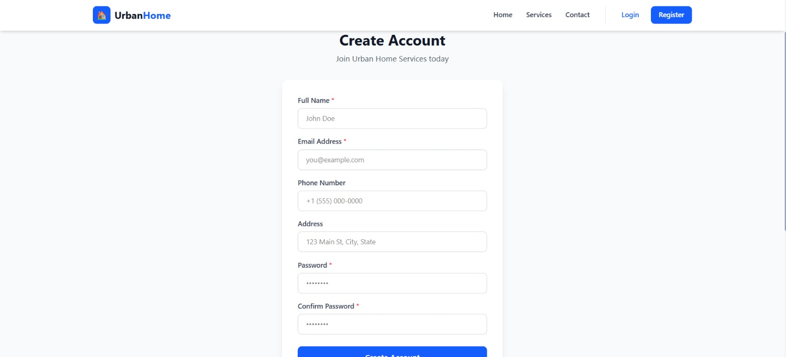
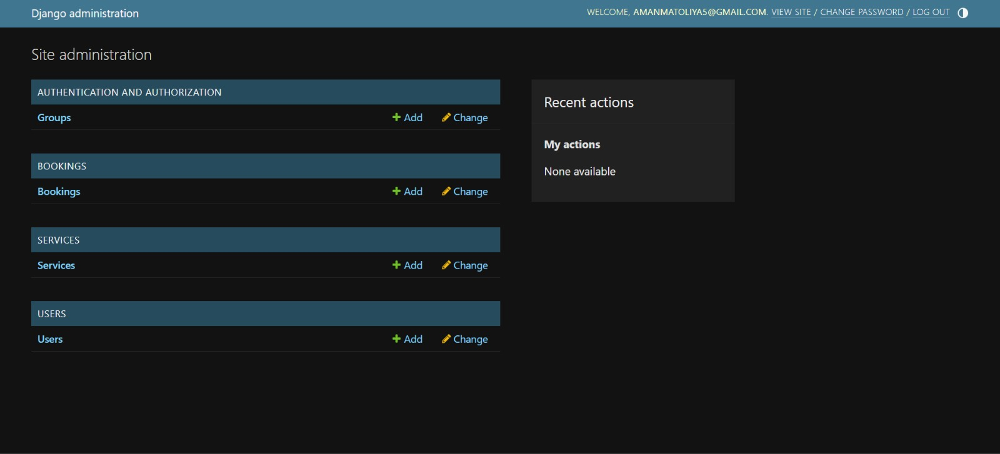

# 🚀 ServiceLink

A full-stack home service booking platform built with React, Django REST Framework, and SQLite.

ServiceLink connects users with trusted home service providers such as electricians, plumbers, cleaners, painters, and AC technicians. Users can browse available services, create accounts, and book services through a modern web interface, while administrators manage everything through Django Admin.

---

## 📌 Project Overview

ServiceLink is being developed as a full-stack web application for academic and practical learning purposes.

The project focuses on:

- Frontend development with React
- Backend API development with Django REST Framework
- Database management using SQLite
- Authentication and user management
- Service booking workflows
- Full-stack integration between frontend and backend

---

## ✨ Features

### User Features

- User Registration
- User Login
- Browse Services
- Search Services
- Filter Services by Category
- Service Booking Interface
- User Dashboard
- Responsive Design

### Admin Features

- Manage Users
- Manage Services
- Manage Bookings
- Django Admin Panel

### Backend Features

- REST API Architecture
- Custom User Model
- Service Management System
- Booking Management System
- SQLite Database Integration

---

## 📈 Current Development Status

### ✅ Completed

- React Frontend Setup
- Django Backend Setup
- SQLite Database Configuration
- Custom User Model
- Service Model
- Booking Model
- Django Admin Panel
- REST API Endpoints
- Authentication Structure
- GitHub Repository Setup

### 🚧 In Progress

- Frontend ↔ Backend Integration
- Dynamic Service Fetching
- Dynamic Booking Management

### 🔮 Planned

- JWT Authentication
- User Profile Management
- Ratings & Reviews
- Service Provider Accounts
- Email Notifications
- Online Payments
- Cloud Deployment

---

## 🏗️ System Architecture

```text
React Frontend
       │
       ▼
Django REST API
       │
       ▼
Django ORM
       │
       ▼
SQLite Database
```

Current Service Flow:

```text
User
 ↓
React Frontend
 ↓
Django API
 ↓
Database
```

---

## 🛠️ Tech Stack

| Layer | Technology |
|---------|-----------|
| Frontend | React |
| Build Tool | Vite |
| Styling | Tailwind CSS |
| Backend | Django |
| API | Django REST Framework |
| Database | SQLite |
| Version Control | Git |
| Repository | GitHub |

---

## 📂 Project Structure

```text
ServiceLink/
│
├── backend/
│   ├── core/
│   ├── users/
│   ├── services/
│   ├── bookings/
│   ├── requirements.txt
│   └── manage.py
│
├── src/
│   ├── pages/
│   ├── components/
│   ├── context/
│   └── data/
│
├── public/
│
├── package.json
├── vite.config.ts
└── README.md
```

---

## 🔌 API Endpoints

### Users

| Endpoint | Method | Description |
|-----------|--------|-------------|
| `/api/users/register/` | POST | Register User |
| `/api/users/login/` | POST | Login User |

### Services

| Endpoint | Method | Description |
|-----------|--------|-------------|
| `/api/services/` | GET | Get All Services |
| `/api/services/<id>/` | GET | Get Service Details |

### Bookings

| Endpoint | Method | Description |
|-----------|--------|-------------|
| `/api/bookings/` | GET | View Bookings |
| `/api/bookings/` | POST | Create Booking |

---

## ⚙️ Installation

### Clone Repository

```bash
git clone https://github.com/amanmatoliya-commits/ServiceLink.git
cd ServiceLink
```

---

### Frontend Setup

```bash
npm install
npm run dev
```

Frontend will run on:

```text
http://localhost:5173
```

---

### Backend Setup

```bash
cd backend

python -m venv venv

venv\Scripts\activate

pip install -r requirements.txt

python manage.py makemigrations

python manage.py migrate

python manage.py createsuperuser

python manage.py runserver
```

Backend will run on:

```text
http://127.0.0.1:8000
```

Admin Panel:

```text
http://127.0.0.1:8000/admin
```

---

## 🗺️ Development Roadmap

- [x] React Frontend
- [x] Django Backend
- [x] SQLite Database
- [x] REST APIs
- [x] Admin Dashboard
- [x] GitHub Repository
- [ ] Frontend ↔ Backend Integration
- [ ] Dynamic Service Fetching
- [ ] Dynamic Booking System
- [ ] JWT Authentication
- [ ] Ratings & Reviews
- [ ] Payment Integration
- [ ] Cloud Deployment

---

## 📸 Screenshots

Screenshots will be added as the project progresses.

## 📸 Screenshot

### Home Page


### Services Page



### Login Page



### Register Page



### Django Admin Panel



## 🎯 Project Goal

The goal of ServiceLink is to build a modern full-stack service booking platform that connects customers with local service providers through an intuitive interface, REST APIs, and a scalable backend architecture.

---

## 👨‍💻 Author

**Aman Matoliya**

B.Tech Computer Science Student | Full-Stack Web Development Enthusiast

---

⭐ If you found this project interesting, consider giving it a star.
